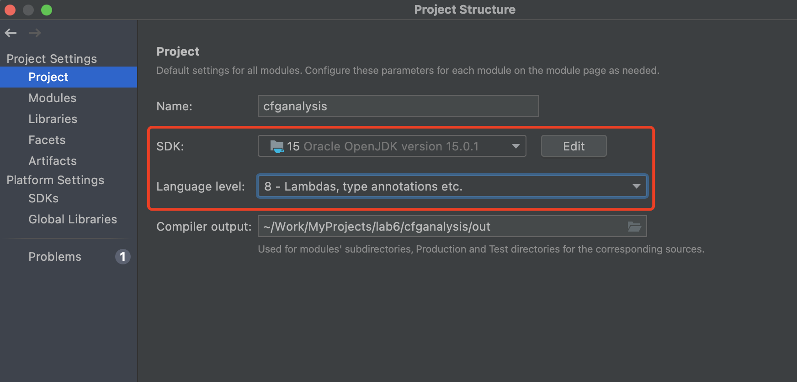
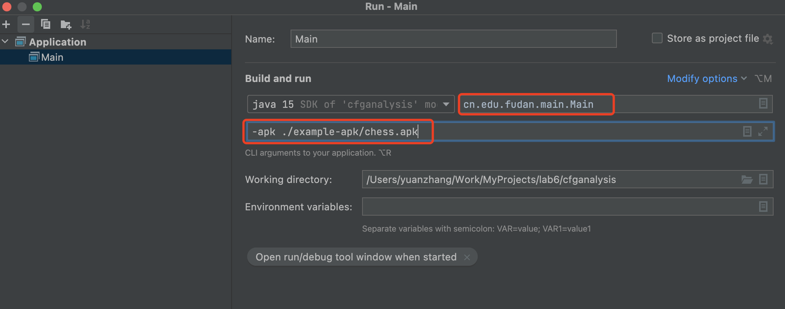
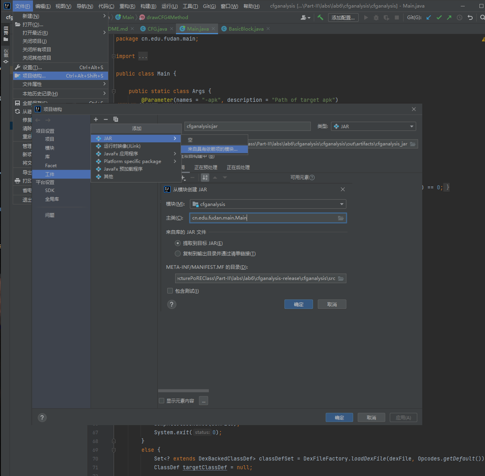
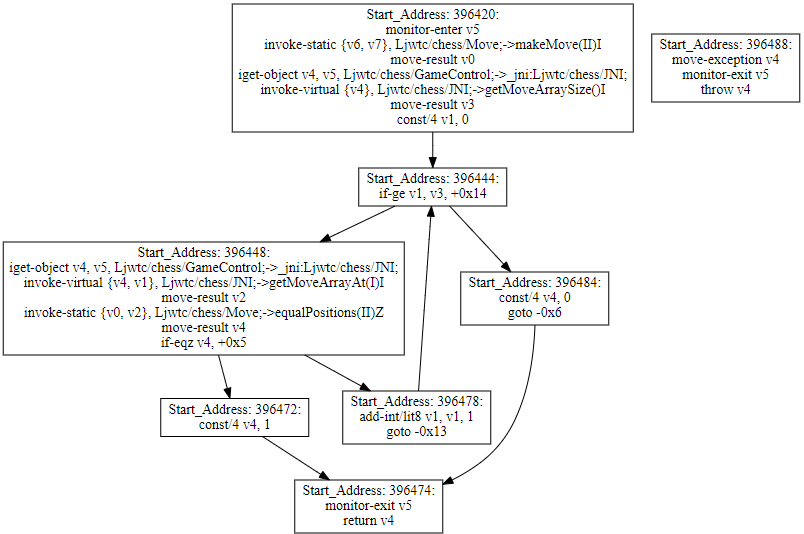
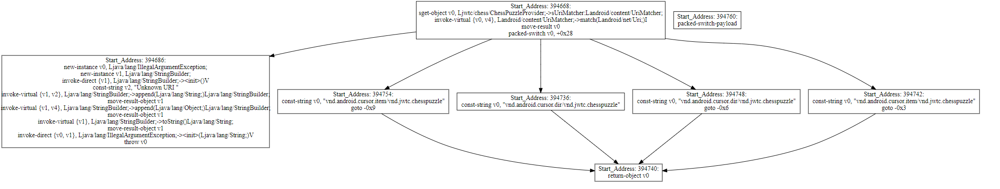

# Lab 6. Build CFG

In this lab, you need to implement the Control Flow Graph (CFG) building algorithm for DEX methods.

## A. Preparation

In this part, you need to learn how to install IDEA and open the lab project.

* Step 1: Download IDEA from [this site](https://www.jetbrains.com/idea/download/) and choose Community version.

  > **Recommended:** `IntelliJ IDEA 2021.3.2 (Community Edition)`.
  >
* Step 2: Install Java SDK 1.8+
* Step 3: Install the the Graphviz Packages: [https://graphviz.org/download/](https://graphviz.org/download/)
* Step 4: Use git command `git pull release master` to get this lab. After you pull the lab, you will see the following files:

```
lab6
└──cfganalysis
        ├──example-apk
        ├──libs
        ├──src
        └──cfganalysis.iml
```

* Step 5: In this directory, we have prepared you an intial project (`cfganalysis`) to finsih the lab. Open the above project in IDEA.
* Step 6: Set **SDK Path** and **Language level** according to this picture.
* Step 7: Try to get familiar with the following command line options.

  * **Command 1**: Dump all the class names in the specified apk. `java -jar cfg.analysis.jar -apk ./example-apk/chess.apk`
  * **Command 2**: Dump all the method names in the specified class: `java -jar cfg.analysis.jar -apk ./example-apk/chess.apk -class jwtc.chess.GameControl`
  * **Command 3**: Draw the CFG for a specified method: `java -jar cfg.analysis.jar -apk ./example-apk/chess.apk -class jwtc.chess.GameControl -method checkIsLegalMove(int,int)`. **Note**: this command would not draw a CFG. This functionality is **your task**! Please see the task description below.

    > Here are two ways for you to run the project.
    >
    > 1. Using the IDEA Run ("Run"->"Edit Configuration").
    >
    >    
    > 2. Build the project into a jar and using command line to run the project.
    >
    >    
    >

## B. Task

In this lab, you are required to complete the missing code of the CFG visualization functionality in the downloaded project. Do not worry. It is not too hard, since we have finished most of the code for you.

1. Read the given code and understand its basic logic. Here we give you some descriptions about the given code in the project.

   * **Main.java**: The entry of the project. You should read its code to understand how the project runs.
   * **BasicBlock.java**: This class represents an BB. We have defined the data structure and methods of it. You should use this class to represent a basic block in the CFG. Please do not modify this class. Otherwise, the CFG visualization may be problematic.
   * **CFG.java**: This class represents an CFG for an DEX method. You should submit your CFG.java to the git and we will run your lab with this file. Please keep other files unchanged and make sure that your IDEA project can be built and executed.
   * **Visualization.java**: This class draws a graph for an `CFG` object. It first translates the cfg into a dot file, and then uses `Graphviz` package to generate a SVG graph.
   * *libs/*: The project depends on many 3rd-party Java libraries. We have collected their jar files in this directory. You do not need to pay attention to this directory.
   * *example-apk/*: We have given a test apk for you. However, your code may be tested under any apk.
2. All you need to do is to finish the `createCFG()` function in `CFG.java`. **Do not modifiy any other code!**

   * In this function, there are already some codes which can help you get familar with necessary APIs and data structures of `dexlib2`. The initial code iterate all the control flow-related instructions of a given DEX method.
   * You can implement this function in your own way. Do not be afraid to modify this function. You just need to keep the function signature (arguments and return value) unchanged.
3. When you finsish the `createCFG()` function, you can use the following commands to test. If you have correctly implemented this function, you will find a svg file in the root directory of the project. Open the svg file, and it looks like this:

   `java -jar cfg.analysis.jar -apk ./example-apk/chess.apk -class jwtc.chess.GameControl -method checkIsLegalMove(int,int)`

   

   `java -jar cfg.analysis.jar -apk ./example-apk/chess.apk -class jwtc.chess.ChessPuzzleProvider -method getType(android.net.Uri)`
   

## C. Submit Your Code Using Git

Once you finished your task , you need to submit the following files:

1. *CFG.java* and *cfganalysis.jar*.
2. Brief description about how you finish this task and screenshots of visualized CFGs.

```
lab6
   ├──CFG.java
   ├──cfganalysis.jar
   └──2030XXXXXXX.pdf

```
